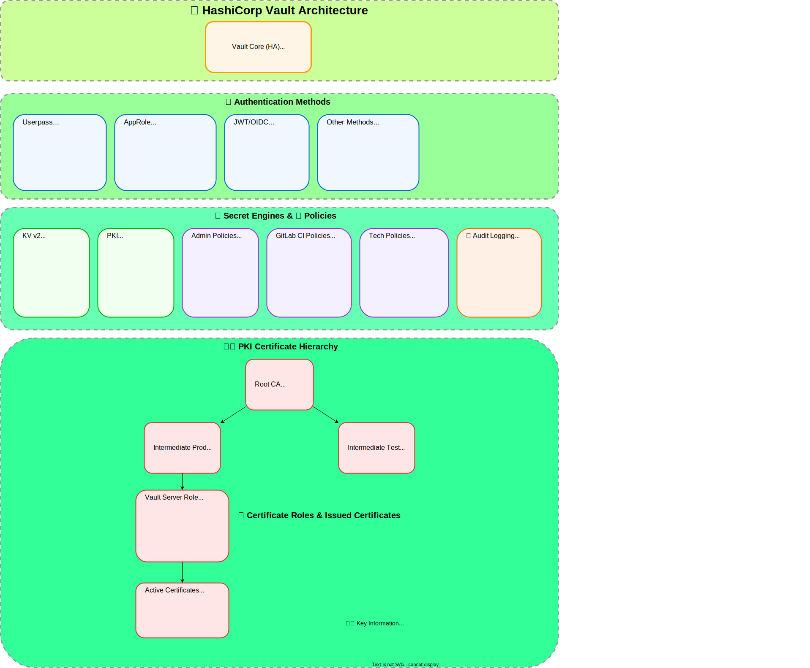

#  vault.rachuna.dev — Klaster HashiCorp Vault HA

::include{file=.gitlab/badges.md}

**Centralna infrastruktura sekretów i PKI dla ekosystemu `dev.rachuna`**

::include{file=repositories.md}

---

## 📋 Opis biznesowy

Projekt `vault-rachuna-dev` to **3-węzłowy klaster HashiCorp Vault w wersji HA** zarządzany w pełni jako kod (GitOps). Klaster stanowi centralny punkt zarządzania sekretami, certyfikatami i autoryzacją dla całego ekosystemu infrastruktury.

### Cel projektu

- Centralne **zarządzanie sekretami** (kluczami API, tokenami, hasłami) dla CI/CD pipeline'ów
- Wewnętrzna **hierarchia PKI** (Root CA → Intermediate CAs → certyfikaty TLS)
- **Autoryzacja** dla aplikacji i agentów (userpass, AppRole)
- **Audit logging** na wszystkie operacje w Vault

### Założenia architektoniczne

- Immutable infrastructure — wszystko jako kod (IaC)
- High availability z automatycznym failoverem
- TLS wszędzie (Vault ↔ HAProxy ↔ klienci)
- Zero trust — każdy serwis uwierzytelniony i autoryzowany
- Centralne pipeline'y CI/CD w [dev.rachuna/flows/gitlab](https://gitlab.com/dev.rachuna/flows/gitlab)

---

## 🌐 Architektura sieciowa klastra

### Topologia fizyczna


### Stos serwisów na każdym węźle

| Serwis | Port | Rola | Config |
|--------|------|------|--------|
| **Keepalived** | VRRP | VIP failover (10.3.2.254) | FQDN-based health check na :8200 |
| **HAProxy** | 443 (HTTPS) | Load balancer, SNI routing | Frontend: vault DNS names |
| **Vault** | 8200 (HTTP), 8201 (cluster) | Secrets + PKI engine | Storage: RAFT, TLS enabled |

### Routing SNI (HAProxy)

```bash
Client → vault.rachuna.dev:443
  ↓
HAProxy :443 (TCP mode, SNI-aware)
  └─ SNI: vault.rachuna.dev → localhost:8200 (Vault)
```

### Parametry Keepalived

- **Virtual IP:** 10.3.2.254/24 na `eth0`
- **VRRP instance:** `VAULT_VIP`, virtual_router_id 254
- **Health check:** 5s interval, HTTP GET `https://127.0.0.1:8200/v1/sys/health?standbyok=true&sealedcode=503`
- **Advert interval:** 1s
- **Failover:** prioritety: 200 (MASTER vault-1005) → 120 (MASTER vault-1006) → 110 (BACKUP vault-1007)

---

## 🏗️ Architektura logiczna Vault



### Sekrety używane podczas bootstrap

```bash
Vault KV v2: dev.rachuna/infrastructure/vault-rachuna/vault-deployment/
└── vip_authentication_pass (Keepalived auth)
```

---

## 📦


### Struktura metaprojektu

#### `ansible/requirements.yml`

Plik gdzie są zdefiniowane zależności Ansible. Zawiera:

**9 external roles** (pobierane z `gitlab.com/dev.rachuna/artifacts/ansible-roles/`):

- `set-timezone`, `users-management`, `sudo`, `set-hostname`, `ssh-hardening`, `install-packages`, `keepalived`, `haproxy`, `certificates`

**2 local roles** (zdefiniowane w tym repozytorium):

- `install-vault` — instalacja i konfiguracja HashiCorp Vault
- `vault-auto-unseal` — systemd service do automatycznego unseal'u Vault

#### `iac-vault/main.tf.json` + submodules

Plik główny z modułami OpenTofu. Struktura:

```bash
modules/
├── kv                    — Secret Engines (KV v2)
├── users                 — Userpass user accounts (używa external shared module)
├── auth                  — Auth methods (userpass, approle)
├── audit                 — File audit logging
└── pki                   — PKI hierarchy + roles + certs
```

#### `iac-vault/providers.tf`

Konfiguracja providera Vault:

- **Terraform/OpenTofu**: Wymagana nowoczesna wersja
- **Vault provider**: hashicorp/vault
- **Default address**: `https://vault.rachuna.dev`
- **TLS verification**: Włączona

---

## ⚠️ Słabe strony

### **Auto-unseal — niesecure w current implementation**

> [!important]
> ⚠️ **Homelab-only risk** — w production trzeba Transit seal lub cloud KMS
**Rekomendacja:** Migracja na Vault Transit Seal (self-hosted) lub AWS KMS/Google Cloud KMS.

---

## 📁 Struktura repozytorium

```bash
vault-rachuna/              (parent — this directory)
├── gitlab-profile/              ← 📍 You are here
│   └── README.md                (project documentation)
│
├── vault-deployment/            (Ansible provisioning)
│   ├── README.md
│   ├── requirements.yml         (9 external roles + versions)
│   ├── inventory/
│   │   ├── hosts.yml            (vault-1005, vault-1006, vault-1007)
│   │   ├── group_vars/vault/    (shared variables)
│   │   └── host_vars/           (per-host overrides)
│   ├── playbooks/
│   │   ├── install.yml          (main provisioning playbook)
│   │   └── test_connection.yml
│   └── playbooks/roles/         (2 local roles)
│       ├── install-vault/
│       └── vault-auto-unseal/
│
└── iac-vault/                   (OpenTofu/Terraform IaC for Vault)
    ├── README.md
    ├── providers.tf / providers.tf.json
    ├── main.tf / main.tf.json   (root modules)
    ├── variables.tf / variables.tf.json
    ├── kv/                      (KV secret engines)
    ├── auth/                    (auth methods)
    ├── approles/                (AppRole definitions)
    ├── users/                   (userpass users)
    ├── policies/                (ACL policies — 26 files)
    ├── pki/                     (PKI hierarchy + certs)
    ├── audit/                   (audit logging)
    └── tools/                   (helper scripts)
        ├── create-user-account.sh
        ├── tofu-init.sh
        └── tofu-plan.sh
```

---

## 📚 External References

- **HashiCorp Vault:** https://www.vaultproject.io/
- **OpenTofu:** https://opentofu.org/
- **Group milestones:** https://gitlab.com/groups/dev.rachuna/-/milestones/13
- **Artifacts — Ansible roles:** https://gitlab.com/dev.rachuna/artifacts/ansible-roles
- **Artifacts — OpenTofu modules:** https://gitlab.com/dev.rachuna/artifacts/opentofu
- **CI/CD pipelines:** https://gitlab.com/dev.rachuna/cicd/gitlab-ci

---

::include{file=.gitlab/footer.md}
